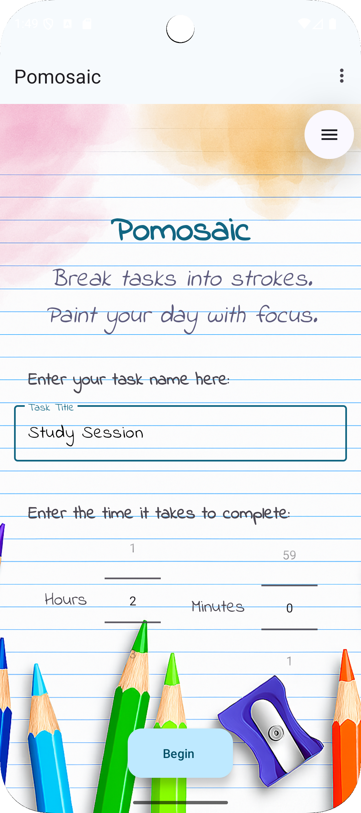
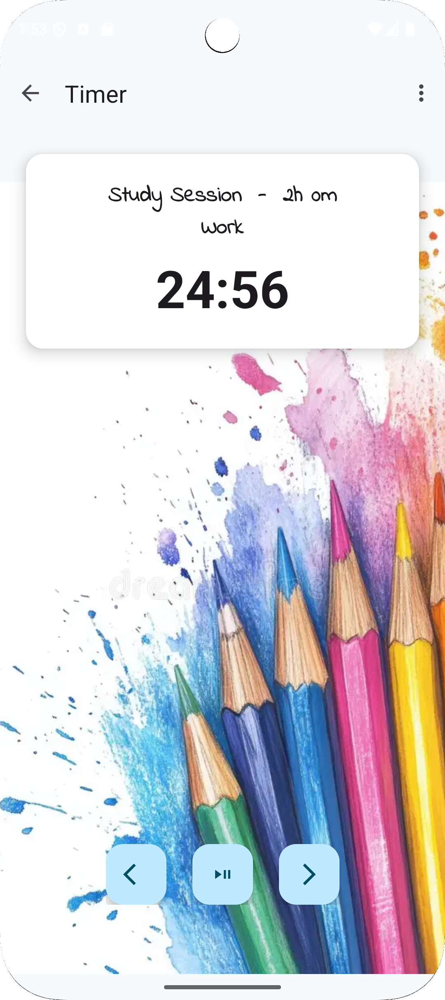

# Pomosaic

Welcome to Pomosaic - a Pomodoro productivity app.  
Pomosaic is unique in its fun and user-friendly interface allowing for *less stress, more progress.*
It helps users manage tasks using the Pomodoro technique while offering a colorful, customizable UI experience. The app focuses on making productivity both effective and visually engaging.

## Features
- Pomodoro Timer – breaks tasks into focus and rest intervals  
- User Preferences – Enable or disable session skips
- Rotation Handling – timer and settings preserved on orientation changes  
- Colors and themes - Bright and inviting graphics and design

## Tech Stack
- **Language:** Java
- **IDE:** Android Studio  
- **UI:** XML layouts with ConstraintLayout, CoordinatorLayout, Toolbar/ActionBar  

## Sneak Peak

<p align="center">
  
   &nbsp;&nbsp;&nbsp;
  
</p>

## Presentation
Chechout our presentation introducing Pomosaic and its features!  
[View Presentation](https://www.canva.com/design/DAGww7YMh5I/J_XxwHUPY1BUB7_NZx4pPw/edit?utm_content=DAGww7YMh5I&utm_campaign=designshare&utm_medium=link2&utm_source=sharebutton)

## Getting Started
1. Clone the repo:
   ```bash
   [git clone] (https://github.com/Cweiss15/Pomosaic)
2. Open the project in Android Studio.
3. Run the app on an emulator or physical device (Android 8.0+ recommended).
